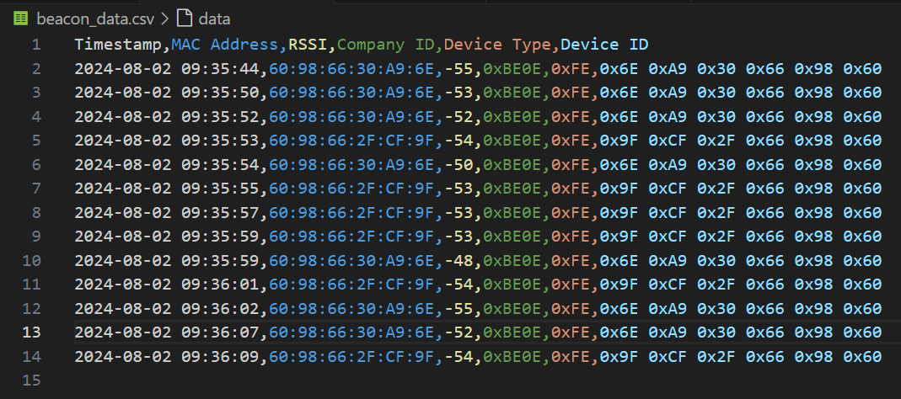
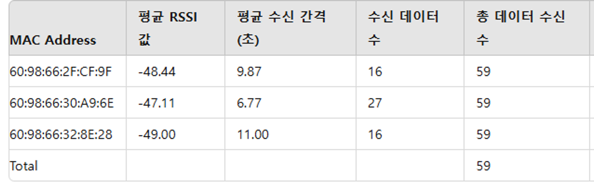

# 8월1주차(2024.07.29~2024.08.04)

{: .note-title }
> **회의 일정**
>
> **2024.07.29(월) 15:00~21:30** (정지원/김지윤/박수진/이다은)
> 
> **2024.07.31(수) 11:00~14:00** (정지원/김지윤/박수진/이다은)
> 
> **2024.08.02(금) 09:00~15:00** (정지원/김지윤/박수진/이다은)

# 1. 데이터 수집의 동기 / 비동기 비교

- 3개의 비콘으로, 고정하여 테스트를 진행하였다. (비콘 간의 거리를 고려하지 않고, 움직이지 않았다.)
  - 60:98:66:32:8E:28 → 28번 비콘
  - 60:98:66:30:A9:6E → 6E번 비콘
  - 60:98:66:2F:CF:9F → 9F번 비콘

## Test1: 코드\_csv 파일 동기 저장

- 동기 코드로 30초 진행(수신기1(이다은))
  
  - 첫 신호를 받아오는데 걸린 시간: 4초
  - 각 비콘마다 2~6초마다 데이터가 수집됨
  >
| |시작 후 신호 받는데 걸린 시간 | RSSI 최대 | RSSI 최소 | RSSI 오차 |
|:-|:--------------|--------------|:---------|:----------|:----------|
| 28번 비콘 | 7초 | -49 | -52 | 3 |
| 6E번 비콘 | 19초 | -48 | -57 | 9 |
| 9F번 비콘 | 26초 | -54 | -57 | 3 |

## Test2: 코드\_csv 파일 비동기 저장

- 비동기 코드로 30초 진행(수신기2(김지윤))
  

  - 첫 신호를 받아오는데 걸린 시간: 7초
  - 각 비콘마다 1초~8초마다 데이터가 수집됨
  >
  | 시작 후 신호 받는데 걸린 시간 | RSSI 최대 | RSSI 최소 | RSSI 오차 |
  | :---------------------------- | :-------- | :-------- | :-------- |:--- |
  | 28번 비콘                     | 7초       | -49       | -52       | 3   |
  | 6E번 비콘                     | 19초      | -48       | -57       | 9   |
  | 9F번 비콘                     | 26초      | -54       | -57       | 3   |

## Test3: 동일한 코드에 대해, 서로 다른 수신기

- 동기/비동기 코드에 대해 각각 다른 수신기를 활용하여 비교 하기에 어려움이 있다.
- 동일한 하나의 코드에 대해, 두 가지의 수신기를 통해 동시에 테스트를 진행해보았다.

### 동기 코드, 서로 다른 수신기 동시 진행(35초)

1. 동일한 환경에서 진행하였음에도, 받아오는 데이터의 개수, 시간 등에 차이가 발생하였다.
2. 비콘과의 거리에 영향일 수도 있으나, 옆자리에 앉은 상태에서 진행하였음에도 RSSI 값의 차이가 발생하였다.

- 수신기1(이다은)

  

  - 각 비콘마다 2초~8초마다 데이터가 수집됨
  >
  | | RSSI 최대 | RSSI 최소 | RSSI 오차 |
  | --------- | --------- | --------- | --------- |
  | 28번 비콘 | -49 | -51 | 2 |
  | 6E번 비콘 | -49 | -54 | 5 |
  | 9F번 비콘 | -53 | -56 | 3 |

- 수신기2(김지윤)
  
  - 각 비콘마다 1초~12초 간격으로 데이터가 수집됨
  >
  | | RSSI 최대 | RSSI 최소 | RSSI 오차 | 비고 |
  | :---------------------------- | :-------- | :-------- | :-------- |:---|
  | 28번 비콘 | -60 | -69 | 9 | |
  | 6E번 비콘 | -63 | -71 | 8 | |
  | 9F번 비콘 | -58 | -58 | 0 | 9F번 비콘에 대한 데이터는 하나만 존재한다. |

### 비동기 코드, 서로 다른 수신기 동시 진행(35초)

1. 수신기2인 경우 RSSI 값이 비교적 작게 나왔으며, 오차 또한 크게 나타났다.

- 수신기1(이다은)
  
  - 각 비콘마다 2초~18초 간격으로 데이터가 수집됨
  >
  | | RSSI 최대 | RSSI 최소 | RSSI 오차 | 비고 |
  | :---------------------------- | :-------- | :-------- | :-------- |:---|
  | 28번 비콘 | -49 | -49 | 0 | 28번 비콘에 대한 데이터는 하나만 존재한다. |
  | 6E번 비콘 | -48 | -55 | 7 | |
  | 9F번 비콘 | -53 | -57 | 4 | |
  
- 수신기2(김지윤)
  
  - 각 비콘마다 2초~19초 간격으로 데이터가 수집됨
  >
  | | RSSI 최대 | RSSI 최소 | RSSI 오차 |
  | :---------------------------- | :-------- | :-------- | :-------- |:---|
  | 28번 비콘 | -57 | -71 | 14 |
  | 6E번 비콘 | -62 | -72 | 10 |
  | 9F번 비콘 | -65 | -68 | 3 |

## 실험 데이터 분석

### 고려 사항
- **수신기 사양 차이:** 수신기의 사양에 따른 데이터 처리 능력 차이로 인해 실시간 데이터 수집과 저장 시 딜레이가 발생할 수 있다.
- **실시간 데이터 저장:** 실시간으로 CSV 파일에 데이터를 저장하는 과정에서 발생하는 I/O 딜레이가 동기와 비동기 코드 모두에서 영향을 미칠 수 있다.
- **실시간 터미널 출력:** 실시간으로 터미널에 데이터를 출력하는 경우에도 딜레이가 발생할 수 있으며, 이는 특히 비동기 코드에서 더 큰 영향을 줄 수 있다.

### 결과 비교
- **동기 수집**: 초기 신호 수신 시간과 데이터 수집 주기에서 안정적이나, 첫 신호 수신 시간은 비동기보다 짧았다.
- **비동기 수집**: 첫 신호 수신 시간이 길었으며, 데이터 수집 주기는 다소 불규칙적이었다.
- **수신기 차이**: 동일한 코드와 환경에서도 수신기 사양 및 위치에 따라 데이터 수집 시간과 RSSI 값에 큰 차이가 발생하였다.
  - 수신기1(이다은)의 경우, 동기/비동기 모두에서 RSSI 값의 오차가 상대적으로 작았다.
  - 수신기2(김지윤)의 경우, 비동기 수집에서 RSSI 값의 오차가 더 크게 나타났으며, 이는 수신기의 사양 차이와 관련이 있을 수 있다.

### 결론
- 데이터 수집 방법(동기/비동기)에 따라 첫 신호 수신 시간과 데이터 수집 주기, RSSI 값의 오차가 다르게 나타났다.
- 수신기 사양과 같은 하드웨어 차이가 데이터 수집의 일관성에 영향을 미쳤으며, 이러한 차이를 최소화하기 위해 데이터베이스 연결과 같은 더 안정적인 저장 방식을 고려할 필요가 있다.
- 실시간 데이터 수집과 저장 과정에서 발생하는 다양한 딜레이 요인을 고려하여, 적절한 데이터 수집 방법과 환경을 설계하는 것이 중요하다.

---
# 2. 비콘 데이터 수집 테스트

## 1) 동일 환경에서 개별 비콘 데이터 수집

### 목적
동일한 환경에서 각 비콘이 유사한 RSSI 값을 보내는지 확인.

### 방법
1. 비콘과 수신기를 고정된 거리에서 설치.
2. 각 비콘의 신호를 일정 시간 동안 수신.
3. 수신된 신호의 RSSI 값과 수신 간격을 기록.

### 결과


### 결론
- 고정된 거리에서 유사한 RSSI값을 수신할 수 있으나, 수신간격에서 차이가 있음을 확인함.

---

## 2) 엘리베이터 환경에서 비콘 데이터 수집

### **목적**
- 외부 신호가 차단된 엘리베이터 내에서 비콘 신호 수신 간격 확인
- 실내, 실외 비콘 신호 수신 상태와 비교

### **방법**
1. 엘리베이터 내부에 비콘 송신기를 설치한다.
   - 거울 방향 좌측/우측, 문 방향 좌측 설치
   - 수신기 거울 방향 가운데 고정
2. 수신기에서 수신되는 비콘 신호의 주기와 RSSI 값을 기록한다.

### 결과
- 1개 비콘 테스트
  
- 3개 비콘 동시 테스트
  
- 엘리베이터 작동 유무에 따라 신호 수신 간격과 RSSI 값 차이 발생
- 엘리베이터 작동 시 신호 수신 간격이 길어지고 RSSI 값이 낮아짐
- 비콘 설치 위치에 따라 신호 수신 안정성에 차이 발생
- 비콘을 여러 개 동시 송수신 할 때 신호 수신이 비교적 안정적임

### 결론
엘리베이터에는 주파수 간섭이 적을 것이라 가정하고 데이터가 1초 간격으로 수신될 것으로 예상하였으나, 테스트 결과 실내에서의 테스트보다 데이터 수신이 지연됨을 확인함.

조사 결과, 엘리베이터와 같은 금속으로 구성된 좁은 공간은 전파를 반사하고 흡수하는 성질이 있어 비콘 신호 수신에 영향을 미친 것으로 예상됨.

---

## 3) 거리별 데이터 수집

### 실외 테스트 환경
 

### 실내 테스트 환경


### **목적**
- 수신기를 이동하며, 거리 별 비콘 신호 수신 상태 확인
- 송신기와 수신기 간 거리 변화에 따른 신호 상태 분석
- 알고리즘 개발 시 참고할 요소 파악

### **방법**
1. 비콘 송신기를 설치한다.
2. 수신기를 들고 송신기로부터 점진적으로 멀어지면서 1m간격으로 데이터를 수집한다.
3. 각 위치에서 수신되는 신호의 주기와 RSSI 값을 기록한다.

### 1) 실외 결과


### 2) 실내 결과


### 결론
실내, 실외 환경 모두 1m 간격으로 총 20m까지 이동하면서 데이터를 수집한 결과, 테스트 전 비콘과 수신자 간의 거리가 멀어질 수록 수신 강도가 낮아질거라 생각하였지만, 실제 테스트 결과 뚜렷한 신호 강도 변화는 나타나지 않았다.

다음 테스트에서는 비콘 개수, 거리 간격을 늘려 데이터를 수집할 예정이다.

---

# 추가 1) 데이터베이스를 활용한 신호 저장

- 데이터 수집의 일반화를 위하여 MySQL 데이터베이스를 활용해 보았다.

  ```python
  import asyncio
  from bleak import BleakScanner
  from datetime import datetime
  import aiomysql

  TARGET_COMPANY_ID = [0x0E, 0xBE]  # 타겟 회사 ID
  found_devices = {}

  # Remote MySQL 데이터베이스 연결 설정
  DB_HOST = "***********"
  DB_USER = "***********"
  DB_PASSWORD = "***********"
  DB_NAME = "***********"

  # 데이터베이스 초기화 함수
  async def init_db():
      conn = await aiomysql.connect(host=DB_HOST, user=DB_USER, password=DB_PASSWORD, db=DB_NAME)
      async with conn.cursor() as cursor:
          await cursor.execute('''
              CREATE TABLE IF NOT EXISTS beacons (
                  id INT AUTO_INCREMENT PRIMARY KEY,
                  timestamp VARCHAR(255),
                  mac_address VARCHAR(255),
                  rssi INT,
                  company_id VARCHAR(255),
                  device_type VARCHAR(255),
                  device_id VARCHAR(255)
              )
          ''')
          await conn.commit()
      conn.close()

  # 데이터베이스에 데이터를 비동기적으로 삽입하는 함수
  async def insert_to_db(timestamp, mac_address, rssi, company_id_hex, device_type_hex, device_id_hex):
      conn = await aiomysql.connect(host=DB_HOST, user=DB_USER, password=DB_PASSWORD, db=DB_NAME)
      async with conn.cursor() as cursor:
          await cursor.execute('''
              INSERT INTO beacons (timestamp, mac_address, rssi, company_id, device_type, device_id)
              VALUES (%s, %s, %s, %s, %s, %s)
          ''', (timestamp, mac_address, rssi, company_id_hex, device_type_hex, device_id_hex))
          await conn.commit()
      conn.close()

  # 비콘 신호를 감지했을 때 호출되는 콜백 함수
  async def detection_callback(device, advertisement_data):
      manufacturer_data = advertisement_data.manufacturer_data
          ...
  ```

  
  - 신호 수신 시간에 대해서 csv 파일로 저장한 결과와 큰 차이는 없는 것으로 보인다.
  - 우선, 테스트를 진행하는 동안에는 csv 파일로 동일하게 하되, 추후 업체와의 미팅을 통해 백엔드 처리에 대해 논의할 계획이다.

# 추가 2 ) 추가로 고안된 아이디어


RSSI값을 필터링 하지 않는 방법으로 고안한 아이디어로, 작업자가 위치한 곳에서 특정 거리 내에 있는 비콘의 개수를 확률적으로 나타내어 확률이 높은 곳이 작업자가 위치한 구역으로 추정하는 방식이다. 예를 들어 여러 테스트 결과 특정 환경에서 작업자로부터 50m 반경에 있는 비콘의 신호세기가 최소 -100dbm 이라고 할 때, 작업자가 수신받은 비콘 신호데이터에서 -100dbm 보다 큰 신호들의 비콘만 추려 낸 다음 추려진 비콘이 어떤 구역의 비콘인지를 계산한다. 위의 그림에서 작업자의 50m 반경 내에 있는 비콘이 A구역에는 8개 B구역에는 1개, C 구역에는 3개, D구역에는 0개임을 확인할 수 있다. 이를 확률로 나타내면 작업자가 A구역에 있을 확률은 6/12=1/2, B구역에 있을 확률은 1/12, C구역에 있을 확률은 3/12=1/4 , D구역에 있을 확률은 0/12 = 0 이 된다. 따라서 가장 작업자는 A구역에 있다고 추정할 수 있고 B보다는 C에 가까운 A구역에 있다고 추정할 수 있다.

물류창고와 같은 넓은 공간과 같이 한 구역에 여러 개의 비콘을 설치 할 수 있는 곳에서는 해당 아이디어로 유효한 확률을 계산할 수 있을 거라 예상하지만, 실제 프로젝트 테스트 공간인 인천대학교 정보기술대학에서는 한 구역에 적당한 간격만큼 비콘을 설치할 경우 공간 크기의 제약으로 많은 수의 비콘을 설치하기 힘들기 때문에 유효한 확률 값을 얻기는 힘들 것이라 예상한다.

---


